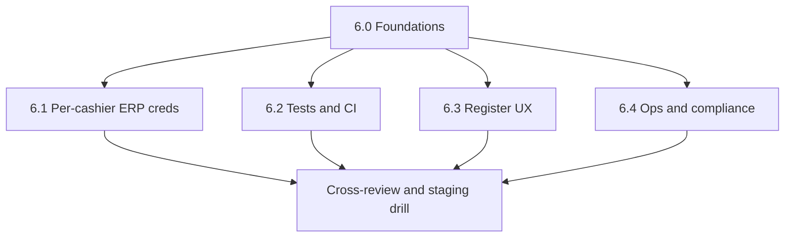

# Centy POS — Phase 0 and Phase 1

**System of record:** `https://erp.tarakilishicloud.com` (Frappe / ERPNext v15).  
**Hub surface:** `https://staging.centyhq.com` (B2B Hub repo — POS shell route in Phase 1).

---

## Phase 0 — Pre-build readiness

**Goals**

- Single ERP origin for all stock, GL, POS Invoice, compliance, and idempotency keys.
- Bench access on the same host as ERP; backups before first `install-app`.
- Integration map: Hub calls ERP via server-side Frappe API credentials (same pattern as CentyHR BFF / Hub proxy), not direct browser calls to ERP (avoids cross-site cookies and CSRF).

**Exit criteria**

- [ ] Frappe **site name** confirmed for staging (the site bound to `erp.tarakilishicloud.com`).
- [ ] `centy_pos` copied into bench `apps` (or `apps_extra`) and listed in `sites/apps.txt`.
- [ ] `bench migrate` run on that site after install; Custom Fields visible on POS Profile, POS Invoice, Item, Customer, Employee.
- [ ] Navari / `payments` / n8n: not required for Phase 1; document owners before Phase 2.

---

## Phase 1 — Foundations delivered in repo

**Frappe (`frappe-apps/centy_pos`)**

- App shell: `hooks.py` (doc_events for POS Invoice + POS Opening Entry, hourly scheduler stub for receipt retries), `install.py` (idempotent roles), `utils/idempotency.py`, API module stubs, `overrides/pos_invoice.py` stubs.
- **Roles:** Centy POS Cashier, Supervisor, Manager, Pharmacist (+ fixtures + `after_install`).
- **Custom fields:** POS Profile (including cash movement approval threshold), POS Invoice (including unique `centy_pos_client_request_id`), Item pharmacy block, Customer identifiers, Employee pharmacist registration.
- **DocTypes:** Centy POS Cash Movement (submittable, idempotency `client_request_id`), Centy POS Controlled Drug Register (submittable, controlled-item validation, Schedule II prescriber rule).

**Hub (`b2b-staging-wt`)**

- `/centy-pos` hub page (ERP desk link, same pattern as CentyPack).
- `centyposHubVisible` on `GET /api/auth/me` — Phase 1: company **admin** / **super_admin** only (tighten or add `centypos_beta` later like CentyPack).

**Phase 2 (implemented in repo)**

- Whitelisted ERPNext APIs under `centy_pos.api.*` (cart, shift, checkout, hold, returns, receipt, etims).
- POS Invoice hooks: cashier discount cap, controlled-drug register auto-create (uses `frappe.flags.centy_pos_prescription` set during `submit_invoice`), WhatsApp receipt queue (stub worker + hourly retries).
- Pay Hub: `POST /api/centy-pos/frappe` proxies to `/api/method/...` with token auth (`CENTYPOS_ERP_*` or `HR_ERP_*`).

**Phase 3 (implemented in repo)**

- **Receipts:** PDF via `frappe.get_print(..., as_pdf=True)`; optional JSON POST to `centy_pos_receipt_webhook_url` with configurable secret, timeout, and print format. Without a webhook URL, delivery is logged and WhatsApp status may be marked sent for dev. Optional `centy_pos_sms_webhook_url` for SMS path.
- **eTIMS:** `get_etims_status` read-through from consolidated Sales Invoice; `mirror_etims_from_consolidated_sales_invoice` persists Navari-style SI fields onto POS Invoice custom fields; `retry_etims_submission` runs optional site-config callable, optional Navari `send_invoice_details` when `kenya_compliance_via_slade` is installed, then a final mirror.
- **Hub:** `POST /api/centy-pos/frappe` uses `CENTYPOS_ERP_*` when both are set; otherwise `resolveHrProxyErpApiKeySecret` (same as HR — `hr_erp_credentials` / `HR_ERP_API_*`). Client helper: `centyPosFrappeCall` in `b2b-staging-wt/client/src/lib/centyPosClient.ts`.

**Phase 4 (implemented in repo — Hub)**

- **`/centy-pos`** React workspace: `b2b-staging-wt/client/src/components/centy-pos/CentyPosWorkspace.tsx` (lazy-loaded via `centy-pos-hub.tsx`). **Connect** tab: POS Profile name + `get_pos_profile_context`. **Register**: search / barcode (`get_item_for_cart`), cart editor, `price_cart` preview, `submit_invoice` (single primary payment mode = grand total), optional prescription JSON for controlled lines, **Save hold**, **Last sale** + `get_receipt_delivery_status`. **Shift**: opening balances, `open_shift`, `get_shift_summary`, closing amounts + `close_shift`, **Clear saved opening** for stale browser state. Local persistence: profile, opening entry, `device_id` (`localStorage`).
- Per-user **Frappe API keys** UI: `CentyPosCredentialsForm.tsx` (embedded on hub + **Settings → Centy POS** tab when `centyposHubVisible`).
- Requires **ERP user** tied to the Hub proxy credentials to have POS permissions; multi-cashier per-user keys are **Phase 6.1** (schema exists; runbook in checklist).

**Phase 5 (implemented in repo — Hub)**

- **Holds** tab: `list_held`, `resume_hold` (loads cart + customer), `discard_hold` with reason. **Returns** tab: `get_returnable_items`, `create_return` (refund to first payment mode — use Desk for split tenders).
- **Not yet in Hub UI** (still Desk / API): eTIMS **Mirror / Retry** buttons, WhatsApp/SMS queue triggers, phone override on receipt send — APIs exist in `centyPosClient.ts`; wire when Phase 6.4 UX is prioritized.

**Phase 6 — plan (all tracks; execute in parallel where possible)**

Cross-cutting goals: **production-safe multi-cashier**, **regression safety**, **fast register UX**, **auditable compliance**. Order below is **dependency-first**; several streams can run in parallel after **6.0** is agreed.

---

### 6.0 — Foundations (short, blocking)

| Item | Owner | Outcome |
|------|--------|---------|
| **Environment matrix** | DevOps | Document: staging ERP site, Hub URL, which Frappe users exist (integration vs cashier test users), Navari on/off. |
| **Secrets & rotation** | Security | Policy: who can see Hub DB API secrets; rotation runbook; optional envelope encryption for stored secrets later. |
| **Feature flags** | Eng | Optional `CENTYPOS_USE_USER_ERP_CREDS=1` (or similar) to roll out per-cashier keys without breaking existing tenants. |

---

### 6.1 — Per-cashier / per-user Frappe credentials (Hub + ERP)

**Problem:** POS Opening Entry is tied to **Frappe `owner`**; submits must match that user when ERPNext enforces shift ownership.

**Deliverables**

1. **Pay Hub schema**  
   - New table e.g. `centypos_erp_credentials` (or extend `hr_erp_credentials` with a `purpose` / `app` column — prefer **separate table** to avoid HR coupling): `user_id`, `frappe_api_key`, `frappe_api_secret`, optional `company_override`, `created_at`, `updated_at`.  
   - Migration + Drizzle (or project ORM) model; **no secrets in client**.

2. **Resolution order in `centyPos` proxy**  
   - If `CENTYPOS_ERP_*` env both set → site-wide POS integration (current).  
   - Else if user row exists with full key pair → **use that** for `POST /api/centy-pos/frappe`.  
   - Else → existing `resolveHrProxyErpApiKeySecret` / `HR_ERP_*` (current HR parity).  
   - Document precedence in `.env.example` + README.

3. **Admin / self-service UX**  
   - Company admin screen: paste Frappe **API Key / Secret** for a Hub user (or “link to ERP user email” if you add lookup later).  
   - Validation: optional `GET` ping to ERP with new keys before save (e.g. `get_pos_profile_context` with a known profile name from settings).

4. **ERP / process**  
   - Runbook: create **one Frappe user per cashier** (or per device), grant POS roles, generate API key/secret, assign to Hub user row.  
   - **POS Profile** “Applicable for Users” must include those Frappe users where ERPNext requires it.

**Exit criteria:** Two different Hub users with two different key rows can each open a shift and submit on the same site without sharing one integration user.

---

### 6.2 — Quality & safety (automated)

**Frappe (`centy_pos`)**

- Add **`pytest`** (or Frappe’s test runner) under e.g. `centy_pos/tests/`.  
- **Priority cases:** `client_request_id` idempotency (submit, hold, close shift, cash movement, return); `save_hold` / `resume_hold` / `discard_hold`; `create_return` with partial quantities; `get_returnable_items` edge cases (fully returned).  
- **Mocks:** minimal — prefer **test site** with fixtures over heavy mocking where feasible.  
- **CI:** run tests on PR touching `frappe-apps/centy_pos` (image with bench or `frappe` test harness as repo standard allows).

**Hub (`b2b-staging-wt`)**

- **API smoke:** script or Playwright that logs in, hits `POST /api/centy-pos/frappe` with `get_pos_profile_context` (or health method), asserts 200 + shape.  
- **Optional E2E:** `/centy-pos` connect → open shift (test profile) → search → submit (test item) on **staging only** (secrets in CI).

**Exit criteria:** CI green on representative Python tests; at least one automated Hub check for the proxy path.

---

### 6.3 — Register UX (barcode, speed, batch/serial)

**Deliverables**

1. **Barcode-first**  
   - Dedicated scan field (always visible on Register); on input, call `get_item_for_cart` with **`barcode`** (not `item_code`); clear field after success; beep/toast on failure.  
   - **USB scanner** usually sends Enter — handle `keydown` Enter in that field without double-submitting forms.

2. **Keyboard & layout**  
   - Shortcuts: focus search / focus scan / focus pay amount (document in UI tooltips).  
   - **Touch / tablet:** larger tap targets, optional compact vs “kiosk” density toggle.

3. **Batch / serial**  
   - When API returns `requires_batch` or `batch_suggestions`, show **modal or inline picker** before adding line; pass `batch_no` (and `serial_no` if applicable) in cart payload aligned with `append_invoice_items`.

4. **Accessibility**  
   - Visible labels, focus order, announce errors for screen readers on critical failures.

**Exit criteria:** Happy path sale completed using **scanner only** (no mouse) on a reference device profile.

---

### 6.4 — Ops & compliance (eTIMS, returns, receipts)

**Deliverables**

1. **Returns + eTIMS**  
   - After `create_return`, show **return invoice name** in Hub; optional **`get_etims_status`**-style read for **return** doc if you add a thin wrapper or reuse SI linkage when Navari writes credit note data.  
   - Doc: what “pending” means and when to retry (align with Navari / KRA expectations).

2. **Receipt observability**  
   - Hub **Last sale** (or invoice lookup): read ERP fields if present (`centy_pos_whatsapp_status`, sent timestamp) via new whitelisted **`get_receipt_delivery_status(pos_invoice)`** or extend existing read API — **no secrets** in response.  
   - Optional: link to ERP form for failed webhook debugging.

3. **Runbooks**  
   - One-pager: “WhatsApp stuck on Failed”, “eTIMS pending after consolidation”, “return posted but refund wrong mode”.

**Exit criteria:** Support can answer delivery / eTIMS state from **Hub + Desk** without reading server logs as the first step.

---

### 6.5 — Suggested sequencing (all crucial; overlap by squad)

- **Week 1:** 6.0 + start **6.1** (schema + proxy) and **6.2** (first pytest file + CI stub).  
- **Week 2–3:** 6.1 admin UI + 6.3 barcode + 6.4 status API; expand **6.2** coverage.  
- **Week 4:** Hardening, docs, staging drill with two cashiers.

---

### Phase 6 — implementation status (in repo)

**6.0 — foundations**

- **`b2b-staging-wt/.env.example`:** Centy POS proxy resolution (`CENTYPOS_ERP_*` → `centypos_erp_credentials` → HR), optional `CENTYPOS_ERP_CREDS_CACHE_MS`.
- **Environment matrix (fill per deploy):**

| Slice | Hub / API origin | `FRAPPE_BASE_URL` | Site-wide `CENTYPOS_ERP_*` | Per-user `centypos_erp_credentials` | Navari / eTIMS |
|--------|------------------|-------------------|----------------------------|--------------------------------------|----------------|
| Staging | e.g. `staging.centyhq.com` | ERP staging site | Optional | Recommended for cashier UAT | As on ERP site |
| Production | e.g. `app.centyhq.com` | ERP prod | Optional (single integration) | Recommended for multi-cashier | As on ERP site |

**6.1 — per-cashier Hub credentials**

- **DB:** `migrations/0096_centypos_erp_credentials.sql`, Drizzle `centyposErpCredentials` in `shared/schema.ts`, `storage` CRUD + `IStorage` methods.
- **Resolver:** `server/lib/centyposErpProxyCredentials.ts` (`resolveCentyposProxyErpApiKeySecret`, cache invalidation on save/delete).
- **Routes:** `server/routes/centyPos.ts` — `POST /api/centy-pos/frappe` uses resolver; **`GET|PUT|DELETE /api/centy-pos/erp-credentials/me`** for company admins (`computeCentyPosHubVisible`).
- **Registration:** `server/routes/index.ts` → `app.use(centyPosRoutes)`.
- **Client helpers:** `client/src/lib/centyPosClient.ts` — `getCentyposErpCredentialStatus`, `saveCentyposErpCredentials`, `deleteCentyposErpCredentials`, plus `centyPosFrappeCall`.

**6.2 — tests (initial)**

- **`centy_pos/tests/test_imports.py`:** asserts `get_receipt_delivery_status` exists on receipt module.

**6.4 — receipt observability (initial)**

- **`centy_pos.api.receipt.get_receipt_delivery_status`:** read-only POS Invoice + profile flags + webhook configured booleans (no secrets).

**Still to build:** use the **execution checklist** below as the single backlog (priorities can shift; keep exit signals).

---

### Phase 6 — execution checklist (plan to finish)

Use this table to drive sprints. **Done** = shipped in repo and verified on staging where noted.

| ID | Track | Task | Depends on | Exit signal |
|----|--------|------|------------|---------------|
| P6-0a | 6.0 | Fill environment matrix row for **each** deploy (Hub URL, ERP URL, integration vs cashier users, Navari on/off) | — | Matrix row exists in runbook / internal wiki |
| P6-0b | 6.0 | Secrets rotation runbook (who edits `centypos_erp_credentials`, key regen in Frappe) | P6-1d | Documented steps, no secrets in git |
| P6-1a | 6.1 | **Run migration** `0096_centypos_erp_credentials` on all Pay Hub DBs | — | Table exists; proxy works with HR fallback only |
| P6-1b | 6.1 | **Hub UI:** form on `/centy-pos` + **Settings → Centy POS** — load/save/delete POS Frappe keys via existing API | `centyPosClient` helpers | **Shipped:** `CentyPosCredentialsForm` + tab `?tab=centy-pos`; verify on staging |
| P6-1c | 6.1 | **Optional validate-on-save:** `get_pos_profile_context` with profile name from env `CENTYPOS_ERP_PROFILE_SMOKE` or user input | P6-1b | Save blocked or warned if ERP rejects token |
| P6-1d | 6.1 | **ERP runbook:** create Frappe user per cashier, POS Profile users, generate API key, paste into Hub | P6-1b | Two test users can each open shift + submit on staging |
| P6-2a | 6.2 | **Frappe pytest:** idempotency (`submit_invoice`, `save_hold`, `create_return`, `close_shift`) on test site or heavy mocks | bench / CI image | ≥4 tests green in CI |
| P6-2b | 6.2 | **Hub smoke:** authenticated `POST /api/centy-pos/frappe` with `get_pos_profile_context` (CI secret or skipped) | CI env | Job green on schedule or PR |
| P6-2c | 6.2 | **Optional E2E:** Playwright `/centy-pos` happy path on staging | P6-1b, P6-3a | Recorded run or nightly artifact |
| P6-3a | 6.3 | **Barcode field** on Register — `get_item_for_cart` with `barcode`, Enter to submit, clear on success | Hub POS page | Scanner-only sale on reference hardware |
| P6-3b | 6.3 | **Batch / serial** — use `batch_suggestions` / `requires_batch`; modal to pick `batch_no` before line commit | P6-3a | Batch item sells without desk |
| P6-3c | 6.3 | **Keyboard shortcuts** + touch density (document in UI) | P6-3a | Shortcuts listed in tooltips or help strip |
| P6-4a | 6.4 | **Last sale / lookup:** call `get_receipt_delivery_status` in Hub after submit + manual invoice id field | receipt API | Status visible without Desk |
| P6-4b | 6.4 | **Returns:** show return invoice name + link; optional `get_etims_status` on return doc if SI-linked | returns UI | Support can trace return + credit path |
| P6-4c | 6.4 | **Runbooks** (1 page each): WhatsApp failed, eTIMS pending, return refund mismatch | P6-4a | Linked from doc or Confluence |
| P6-5 | 6.5 | **Staging drill:** two cashiers, two Hub key rows, same POS profile, shift + sale + return | P6-1d, P6-3a | Sign-off checklist completed |

**Suggested order:** P6-1a → P6-1b → P6-1d (parallel P6-2a) → P6-3a → P6-4a → P6-4c → P6-5 → P6-2b/P6-2c hardening.

---

## References

- CentyPack phase template: `b2b-staging-wt/docs/CENTYPACK_POC_PHASE0_PHASE1.md`
- Deploy pattern (Docker bench): `frappe-apps/centypack/docs/DEPLOY_ERP_DOCKER.md` (adapt paths for `centy_pos`)
